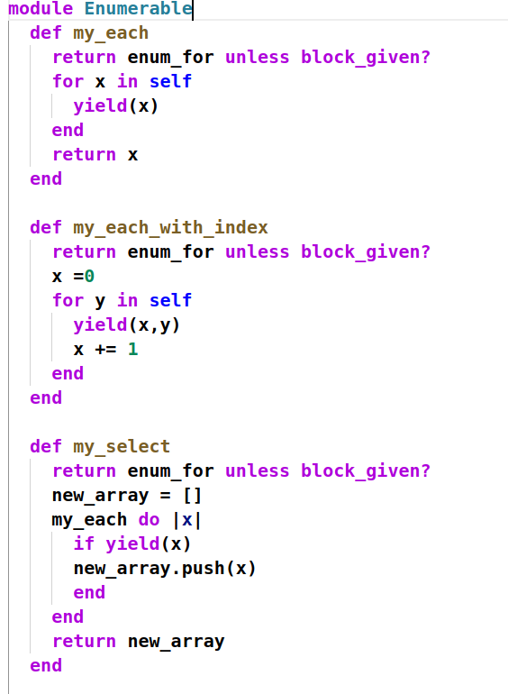
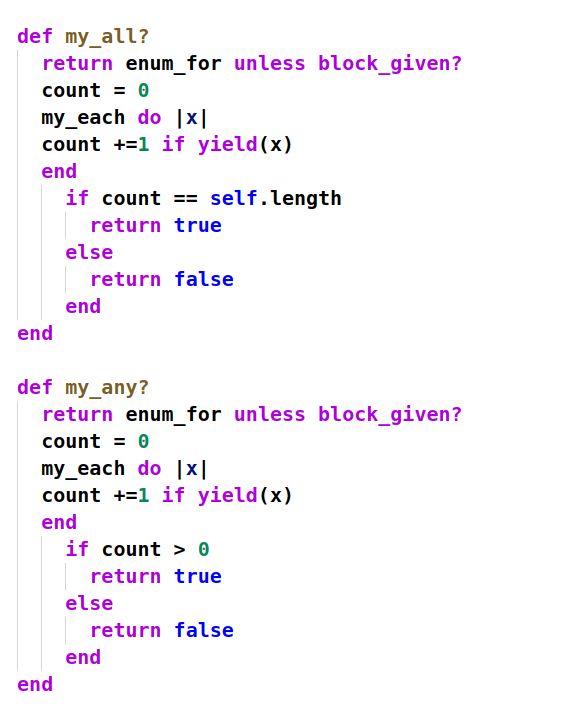
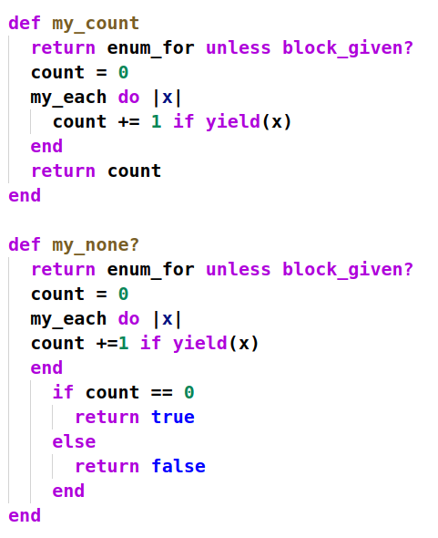
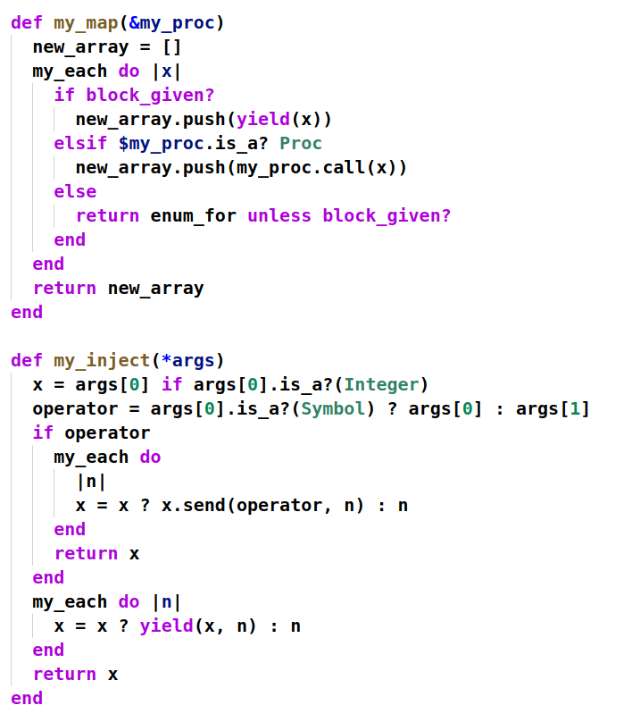
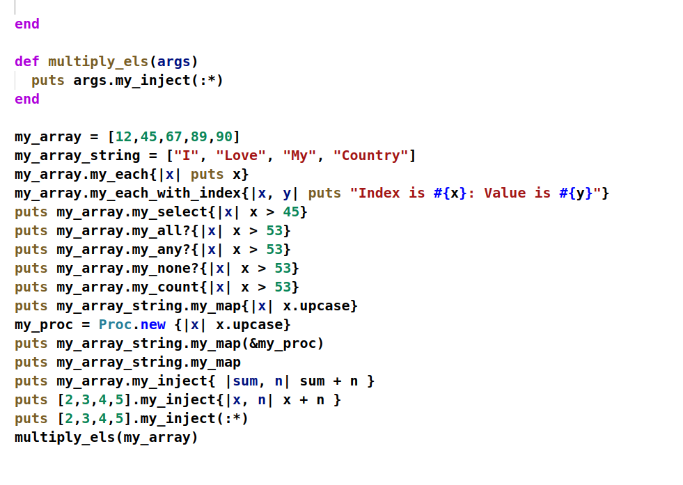
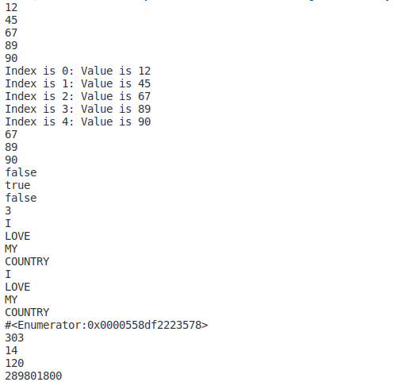

# Enumerables

> Enumerables project. In this project we need to create enumerables (my_each, my_each_with_index , my_all, my_any, my_none,my_inject, my_map) using procs and yield. In this project we learn alot about yield which is very helpfull in rails section.

Additional description about the project and its features.

## Built With

- Ruby

## Live Demo

[Live Demo Link](https://repl.it/@MuhammadFahadFa/LongtermStripedCable)

## Getting Started

**Need web browser.** to download Repository
**Need Terminal** to run the code

To get a local copy up and running follow these simple example steps.

### Download Repository (https://github.com/MFahadUmer/Enumerable)
### open Terminal
### cd enumerable
### ruby enumerable.rb

## Authors

👤 **Muhammad Fahad Umer**

- Github: [@MFahadUmer](https://github.com/MFahadUmer)
- Twitter: [@engfahadumer](https://twitter.com/engfahadumer)
- Linkedin: [linkedin](https://www.linkedin.com/in/engineer-muhammad-fahad-e-umer-08813055/)

## 🤝 Contributing

Contributions, issues and feature requests are welcome!

Feel free to check the [issues page](https://github.com/MFahadUmer/Enumerable).

## Show your support

Give a ⭐️ if you like this project!

## Acknowledgments

- Hat tip to anyone whose code was used
- Inspiration
- etc

